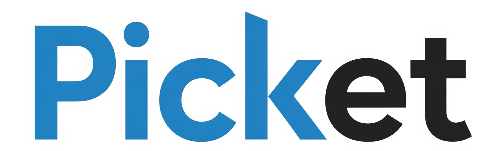

# 🎟️ Picket

  

# 팀 Picketnologia

> 한화시스템 BEYOND 17기 1팀 Picketnologia 미니 프로젝트  
> 개발 기간 : 2025.07 ~ 2025.09

# 프로젝트 주소

[프로젝트 바로가기 - www.picket.o-r.kr](https://www.picket.o-r.kr)

> 일반 사용자   > test01@test.com   > test03@test.com   >  
> 판매자   > test02@test.com
>
>  
> 비밀번호는 모두 qwer1234 입니다.

# 프로젝트 소개

Picket은 공연 예매 플랫폼으로서 최근 공연, 전시 스포츠 이벤트에 대한 관심이 높아지면서 기존 플랫폼들의 많은 수요에도 불구하고 실시간성이 부족한 좌석 예매의 아쉬움을 해결하기 위하여 만들어졌습니다.

Picket에서는 실시간 좌석 기능 제공으로 원활한 좌석 예매 경험을 제공합니다.

## 기술 스택

### Front-end

### Back-end

### DB

### DevOps / Infra

## ERD

## AWS 배포 아키텍처

## CI / CD 아키텍처

## 주요 기능

### 회원가입 / 로그인

### 비밀번호 찾기

### 실시간 좌석 예매 동시성 제어

공연 예매 시 다수의 사용자가 동시에 좌석 예매 화면에서 실시간으로 확인 할 수 있습니다.

### 결제

좌석을 선택하고 다음 단계를 진행하면 결제를 진행 할 수 있습니다.

